# Arova 使用指南

[English](USAGE.md) | **简体中文**

> 当前仓库最新实现：总开关关闭且目标启用时，点击「保存并开启通知」会保存该群并恢复所有已启用群。关闭总开关保留各群配置；保存禁用群或发送测试不会开启通知。下方截图拍摄于此改动前的公开 beta，旧 Release 包仍需单独开启总开关。

适用：当前公开 Beta 版本。更新：2026-09-15。

[功能介绍](https://github.com/spencer17x/arova-releases/blob/main/FEATURES.zh-CN.md) · [下载插件](https://github.com/spencer17x/arova-releases/releases) · [返回首页](README.zh-CN.md)

- [安装与更新](#安装与更新)
- [语言设置](#语言设置)
- [首次上手](#首次上手)
- [账号与登录](#账号与登录)
- [连接监控来源](#连接监控来源)
- [选择自动续期方式](#选择自动续期方式)
- [查看浮窗与配置提醒](#查看浮窗与配置提醒)
- [账号备注与平台搜索](#账号备注与平台搜索)
- [Telegram 通知](#telegram-通知)
- [持续监控](#持续监控)
- [方案与使用权](#方案与使用权)
- [常见问题](#常见问题)

## 安装与更新

### 首次安装

1. 打开 [Releases](https://github.com/spencer17x/arova-releases/releases)，下载所需版本的 `arova-chrome-版本.zip`。
2. 解压到一个准备长期保留的文件夹。选择文件夹时，应能直接看到 `manifest.json`。
3. 在 Chrome 地址栏输入 `chrome://extensions`，开启右上角“开发者模式”。
4. 点击“加载已解压的扩展程序”，选择上一步的文件夹。
5. 从 Chrome 的扩展菜单将 Arova 固定到工具栏，点击图标打开独立管理页。

不要下载 GitHub 自动生成的 “Source code (zip/tar.gz)” 作为安装包，也不要直接选择尚未解压的 ZIP。[Chrome 官方加载说明](https://developer.chrome.com/docs/extensions/get-started/tutorial/hello-world#load-an-unpacked-extension)。

### 更新已安装版本

1. 从 Releases 重新下载新安装包，即使版本名与之前相同。
2. 将新包内容替换到原加载目录，保留原目录位置。
3. 在 `chrome://extensions` 中找到 Arova，点击“重新加载”。
4. 刷新已打开的交易页面；管理页如仍显示旧内容，也重新打开或刷新。

不要先卸载，以保留浏览器设置。GitHub ZIP 不会自动升级已安装的扩展。不要删除仍被 Chrome 加载的文件夹。

同名 Beta 重发时，文件名和版本号可能不变；以 Release 说明、`release-info.json` 的构建标识和 `SHA256SUMS` 区分新旧包。

## 语言设置

管理页侧栏的“界面语言”提供“跟随浏览器 / 简体中文 / English”。中文浏览器默认简体中文，其他浏览器默认英文；手动选择保存在当前浏览器。切换后管理页、已打开的浮窗、授权提示和浏览器通知随之更新，不会清空正在填写的草稿。钱包登录页和收银台在打开时使用所选语言。

Telegram 每个目标有独立“推送语言”，保存该目标后生效。已有目标默认中文；新目标默认当前界面语言。切换插件界面不会修改群组语言。已开始投递的消息重试时仍使用原语言。平台正文、昵称、账号备注、代币名称和管理员自定义方案说明保留原文。

## 首次上手

1. 安装插件并打开管理页，登录或创建 Arova 账号。
2. 在“监控授权”分别连接需要使用的 Fomo / Pump 账号。
3. 阅读续期说明，选择浏览器或服务端方式，完成对应确认。
4. 在“浮窗与本机设置”开启浮窗，打开支持的 XXYY、GMGN 或 DeBot 交易页。
5. 先查看“关注动态”，再按需要配置浏览器提醒、账号备注或 Telegram 目标。

管理页中的设置保存成功后会有反馈；没有新动态时显示空列表不一定代表故障，可先检查来源授权和筛选条件。

## 账号与登录

在“账号与登录”使用 Arova 邮箱密码，或选择页面提供的 Google、Telegram、Solana 钱包、EVM 钱包入口。第三方方式需要在对应授权窗口完成确认，实际可用性取决于服务配置和钱包支持。

Arova 密码与 Google / Telegram 密码不同。使用 Google 身份时点击“使用 Google 继续”，不要把 Google 密码当作 Arova 密码填写。Google 登录应在已正式加载的 Chrome 扩展中完成。

已有账号需要增加登录方式时，先登录原账号，再到“账号与登录”进行绑定，以保留同一账号的配置和备注。相同邮箱或昵称不会自动合并多个账号。

钱包登录由本人签名确认身份，不需要向账号登录页提供私钥，也不等于授权交易或开通 Pump 服务端托管。

## 连接监控来源

1. 登录 Arova，打开“监控授权”。
2. Fomo：阅读托管说明，关闭其他 Fomo 标签页，点击“连接并开启服务端续期”。按需允许 Chrome 权限，在官方页面完成登录。插件自动读取本次页面的会话，验证同账号后提交加密托管，接管时关闭临时授权页；无需填写 Token 或再次提交。
3. Pump：点击“连接账号”，按需在官网登录。连接后，在 Pump 卡片手动填写同账号完整 Solana 私钥，阅读并确认托管说明后提交。插件不会自动读取钱包私钥。
4. 等待服务端续期成功状态，再开启需要的监控和通知规则。Pump 普通连接成功不代表已开启续期。

两个来源独立管理。暂停监控、撤销连接和关闭续期是不同操作。错误会明确提示；结果未确认时先检查状态，再决定是否重试。切换账号、离开或刷新页面可能丢弃敏感材料草稿。

## 选择自动续期方式

本版本仅使用**服务端续期**，旧浏览器续期任务会停止。已有服务端托管保留；撤销后不会自动恢复旧授权。

**Fomo：**点击连接即明确同意读取临时官网页面的 Access Token、Refresh Token 和可选 Privy Access Token，并加密托管到 Arova 服务端及备份。这些不是只读凭据。为避免同一会话并发刷新，其他 Fomo 页面未关闭时会阻止接管；插件不会关闭你原有的页面。缺少凭据、官网变化、拒绝权限或账号变化时会中止并提示。官网登录和验证码仍可能需要本人完成。

**Pump：**服务端续期需要本人手动输入与已连接账号一致的完整 Solana 私钥（Base58），并明确同意托管。普通钱包连接或登录不会提供该私钥；没有同账号私钥时无法开启服务端续期。私钥具有完整钱包控制能力，“仅登录、不交易”是程序限制，不会缩小密钥本身权限。

服务端托管属于实验性能力。关闭 Chrome、退出 Arova 或暂停监控不会撤销托管，应使用“关闭服务端续期”或对应移除按钮。撤销会移除活动材料，加密备份按保留周期过期，无法保证立即擦除。不要把凭据发到聊天或截图。官网验证码、重新登录或撤销会话仍可能需要本人处理。

## 查看浮窗与配置提醒

在“浮窗与本机设置”开启浮窗。它会出现在已支持的 XXYY、GMGN、DeBot 交易页面；位置、尺寸和主题可按设置调整。

浮窗主要用于查看通知：切换关注动态、平台动态、Pump Top，按来源及“全部代币 / 当前代币”筛选；展开消息可查看原文、复制合约或跳转对应交易页面。不同消息使用其自身合约地址。

“代币信息卡”控制卡片显示，不会改变当前代币筛选条件。浏览器通知和 Telegram 总通知可通过浮窗快捷开关调整，详细规则仍在管理页配置。

开启浏览器提醒时还需允许 Chrome 和操作系统通知。关闭浮窗不会停止服务端监控或 Telegram 推送；关闭 Chrome 后不能显示浏览器桌面通知。

## 账号备注与平台搜索

进入“账号备注”，按需求选择视图：

- **我关注的**：读取当前绑定平台账号的真实关注名单。
- **搜索平台用户**：输入账号名或地址，查询平台并标记已关注、未关注或未知。
- **已备注**：管理自己保存的备注，包括已经取消关注的账号。

Fomo 与 Pump 分开查询，默认每页 10 条，可选 10 / 20 / 50 / 100 条。关注关系有短时缓存，页面会显示查询时间；平台刚发生变化时可稍后重新读取。查询失败时“未知”不等于“未关注”。

点击账号的“添加备注 / 编辑备注”填写并保存；“用户主页”会打开对应平台页面。备注只属于你的 Arova 账号，不修改平台昵称或关注关系。关注和取消关注需到对应平台操作。

## Telegram 通知

### 将通知发到群组或频道

1. 将运营提供的 Arova 通知 Bot 加入目标群组或频道，并允许其发送消息。
2. 可通过 Bot 的 `/chatid` 命令获取 Chat ID；填写完整返回值，包括可能存在的负号。
3. 在“Telegram 通知”添加目标，填写群备注和 Chat ID。
4. 选择此目标的推送语言、来源、通知类型，以及是否“在通知中显示我的账号备注”。
5. 点击“保存此目标”；需要开启通知时按页面提示保存并开启。
6. 保存成功后，单独点击“发送测试到此群”，在目标群核对测试消息，再确认 Telegram 总开关与该目标均已启用。

每个目标独立保存、删除和测试，保存不会发送消息，也不会覆盖其他目标草稿。测试仅使用已保存配置；目标有未保存修改时，请先保存。没有选择有效通知类型的目标不会收到自动推送。

Fomo/Pump 通知可包含本次正文、代币头像、原文及合约操作入口；缺少图片时回退文字，没有正文时省略正文。账号备注按每个目标的开关显示。

### 监听群组或频道消息

“监听消息”用于把 Bot 实际收到的指定群组/频道消息纳入动态，和向群里发送提醒的通知目标是两套设置。填写监听 Chat ID 并保存；Bot 还必须能收到该群或频道的消息。这不是 Telegram 个人账号的完整聊天历史读取。

## 持续监控

在“持续监控”按页面选项填写代币合约、链及名称后，点击“添加持续监控”。也可从浮窗当前代币的 `24/7` 入口进入，核对带入的信息再确认。

列表中的项目可按需要停用或移除。持续监控配置不会替你交易；实际动态仍依赖有效来源授权、监控状态、使用权和通知规则。

## 方案与使用权

打开“方案与使用权”查看服务端当前状态及订单。显示免费开放时无需付款；套餐价格、期限与可用渠道以页面为准。管理员赠送或延长期限后，可点击“刷新状态”核对。

无限期权益代表无到期时间；在插件中也可能显示为“永久使用权”。它无需续费，但仍可由超级管理员调整或暂停。获得权益不会自动获得内部管理后台权限。

运营开启付费并配置可用方案后，流程为：选择方案、网络与稳定币 → 创建订单 → 在独立收银台连接钱包并确认操作 → 等待链上核验和权益更新。仅按当前收银台展示的步骤付款，不用文档或聊天中的地址代替订单。

钱包取消后保留原订单；若提示广播结果未知、核验中或“已付款、正在开通”，先查看订单状态，不要重复付款。网络、币种或金额错误时，保留订单号和交易哈希交由运营核对，不承诺自动匹配或退款。

续费会从现有未过期的有效期继续累加；已到期则从开通时开始计时。页面会自动刷新订单，也可手动刷新。服务不自动扣款。

## 常见问题

| 问题 | 排查方式 |
| --- | --- |
| Chrome 无法加载安装包 | 确认已解压，并选中了直接包含 manifest.json 的文件夹；不要选择 Source code 包 |
| 更新后仍是旧界面 | 重新下载同名包，核对构建标识，替换原加载目录并重新加载扩展、刷新交易页 |
| 点击连接提示 user gesture | 更新到当前 Beta 构建，重新加载扩展并重新打开管理页，再点击连接；权限必须由本次点击直接申请 |
| 设置页一直在读取 | 重新加载扩展后重开管理页，检查网络和 Arova 登录状态；仍失败时保留脱敏错误信息 |
| 交易页没有浮窗 | 确认平台/页面受支持、浮窗已开启、扩展有站点访问权限，并刷新页面 |
| 看不到预期动态 | 核对来源授权、监控开关、选中的视图/来源、当前代币筛选和使用权状态 |
| 浏览器通知没出现 | 检查账号提醒、本机通知开关及系统权限；管理页不会重放历史通知，首次读取也不是历史补发 |
| TG 测试按钮不可用 | 先保存当前目标；有草稿或正在提交时不可测试 |
| TG 测试失败或结果未确认 | 检查 Bot 成员/发消息权限和 Chat ID；先看群里是否已收到，结果未知时不要连续重发 |
| 续期未完成 | 核对选定方式和实际保存状态，查看来源提示；官网可能需要重新登录或本人签名 |
| 关注状态不一致 | 查看查询时间，稍后重新读取；平台搜索可能只返回部分匹配结果 |
| 内部后台无法登录 | 普通插件用户无后台权限；自己的配置请通过 Chrome 工具栏打开插件管理页 |

反馈问题时提供插件版本/构建标识、故障时间、所用平台与脱敏错误文本。不要附带密码、Token、Cookie、验证码或钱包私钥。

## 图文上手教程

### 安装与准备
从官方公开下载仓库取得插件 ZIP，解压后在 Chrome 扩展页以“加载已解压的扩展程序”安装。更新同版本包也需要替换文件并重新加载。

### 1. 创建 Arova 账号并登录
在“账号与登录”选择“还没有账号？创建账号”，填写自己的邮箱及至少 12 位的独立密码，点击“创建账号并登录”。Arova 密码与 Google 密码无关。已有账号直接登录，也可以选择已绑定的登录方式。

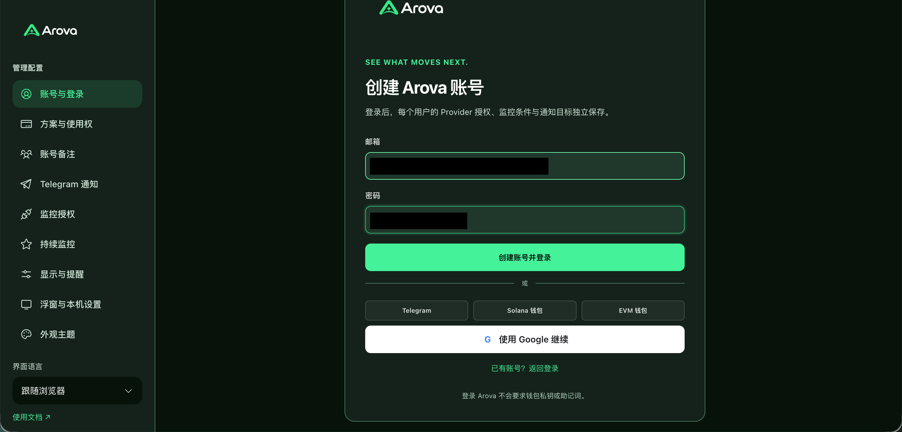

已有账号选择“已有账号？返回登录”，使用刚创建的 Arova 邮箱密码登录。

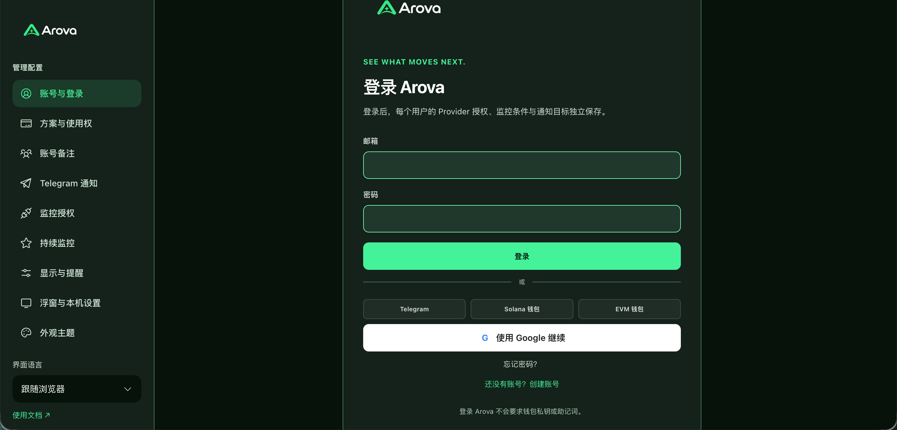

登录成功后，“账号与登录”显示邮箱密码已绑定。Google、Telegram 和钱包身份可另行绑定；这与下一步连接 Fomo/Pump 监控来源是不同操作。

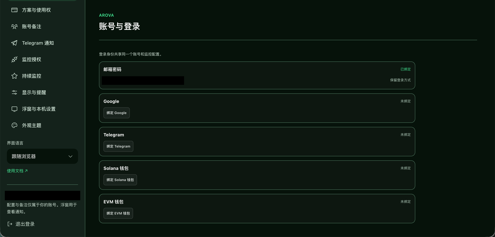

### 2. 连接 Fomo
进入“监控授权”，阅读会话托管说明，关闭其他 Fomo 页面，再点击“连接并开启服务端续期”。在官网完成登录或验证，随后由插件自动完成连接与接管。以“服务端续期授权已保存”的最终状态为准。

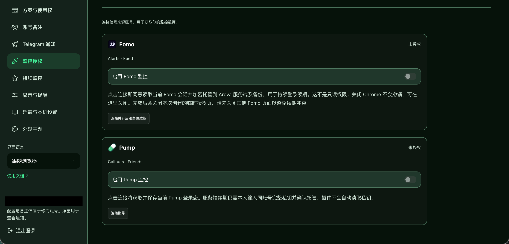

成功时会显示“Fomo 已连接并开启服务端续期”，并在 Fomo 区域显示授权已保存。无需手动填写 Token；遇到账号变化、其他官网页面冲突或验证失败时，按提示处理后再连接。

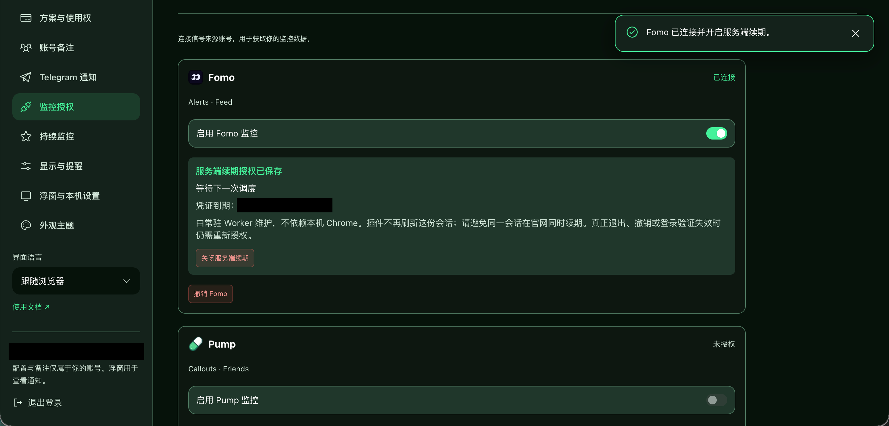

### 3. 连接 Pump 并配置服务端续期
先在 Pump 区域点击“连接账号”，并在官网完成登录。基础连接用于获取当前登录态；持续服务端续期还需完成下面的人工托管配置。

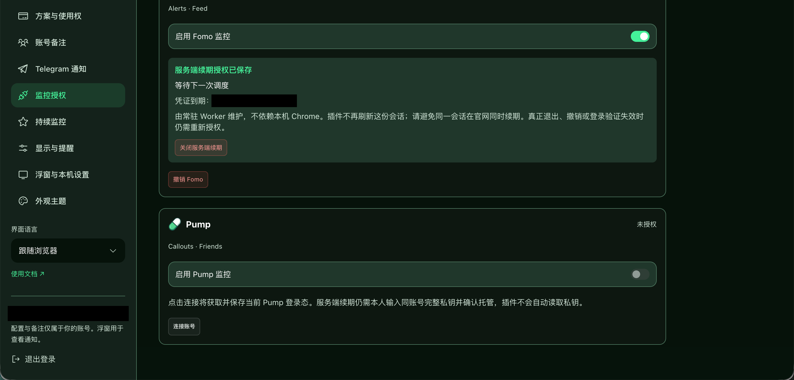

如果决定使用私钥托管续期，由本人在 Pump 官网的钱包导出界面取得同账号私钥。下面截图仅展示官网导出入口，钱包标识已遮盖，不包含私钥。

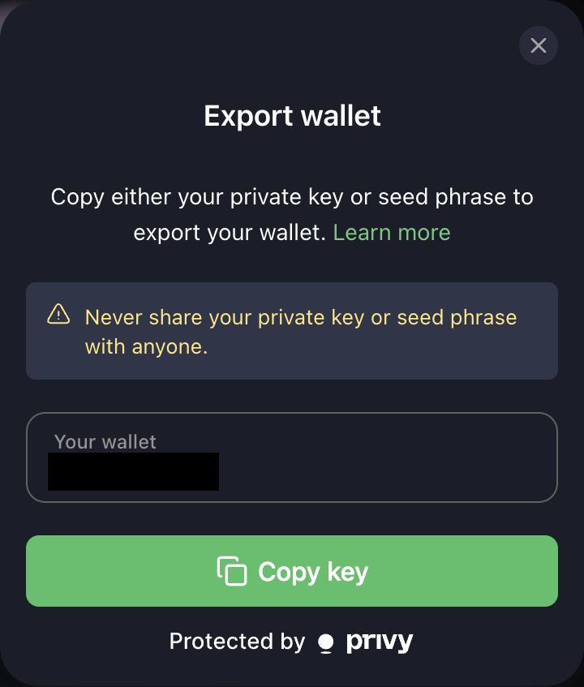

回到 Arova，在 Pump 对应区域手动填写同账号 Solana 私钥（Base58），阅读并勾选托管及持续登录签名确认，再点击“确认配置并开启服务端续期”。只接受对应账号的私钥，不接受助记词、EVM 私钥或登录 Token。

这不是只读授权：完整私钥具有钱包控制能力，“只用于登录、不交易”是程序限制，不是密钥权限限制。材料加密存入服务端及备份，直到主动撤销活动托管；备份按保留周期过期。不要把私钥发到聊天或截图中。

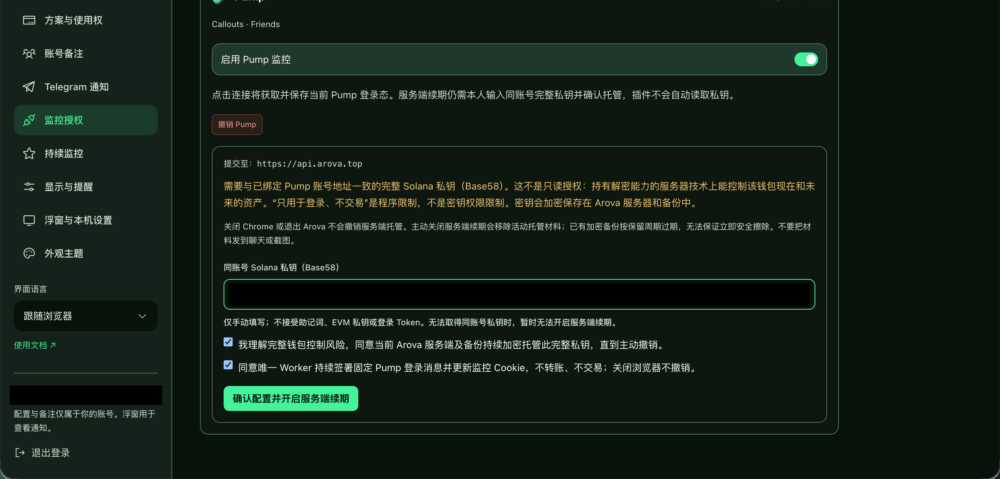

成功后出现“服务端续期授权已保存”，不必再次输入私钥。关闭 Chrome 不会撤销托管；需要移除活动密钥时使用“关闭续期并移除活动密钥”。“等待下一次调度”表示已保存并等待调度，不代表已经完成自然到期后的续期验证。

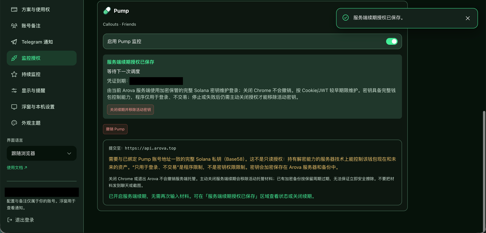

### 4. 配置 Telegram 目标
在“Telegram 通知”添加通知目标，填写群备注和 Chat ID，选择推送语言、来源及是否显示账号备注。每个目标独立保存，不覆盖其他目标草稿。

本次示例只选择 Pump Friends（关注）与 Fomo Alerts（关注），并将 Fomo 类型限制为买入和卖出。平台动态和榜单没有勾选；可以按自己的需要调整。

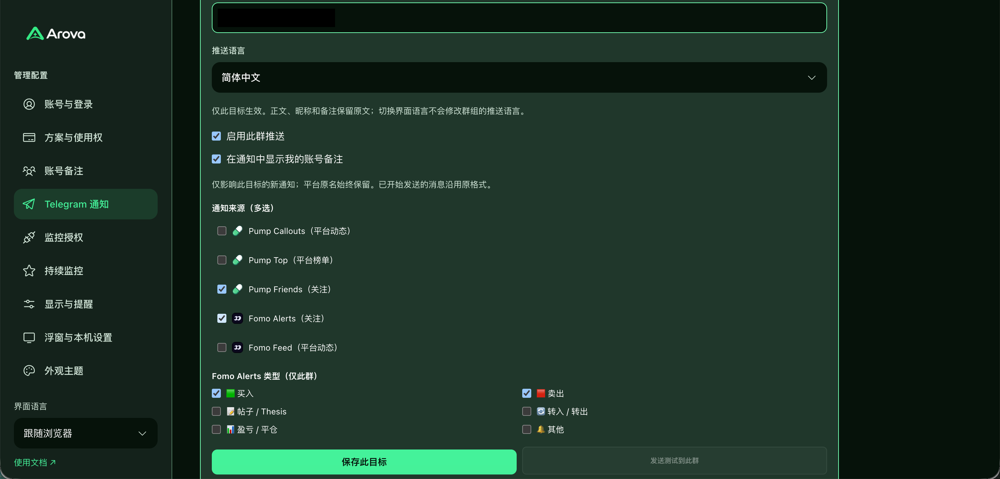

点击“保存此目标”，看到“此目标已保存，未发送测试消息”表示保存成功。测试按钮在目标保存后可用。

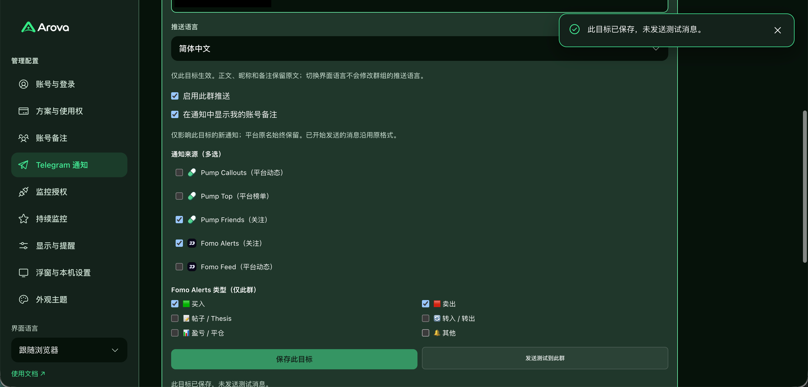

### 5. 单独发送测试消息
先保存目标，再点“发送测试到此群”。保存本身不会发送测试消息；未保存的修改应先保存。检查页面成功提示及群里的“Arova 测试通知”。测试消息不是交易信号。

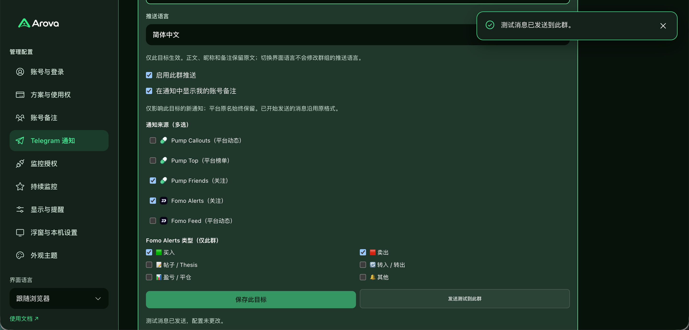

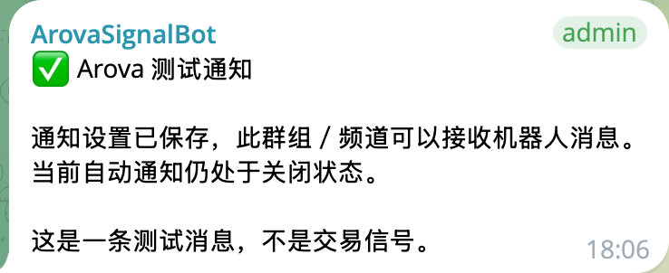

本次收件提示“当前自动通知仍处于关闭状态”：测试成功仅证明机器人能发到该群。要接收后续实时信号，还需要在 Telegram 通知页打开自动通知总开关，并保持此群推送开启。新信号须符合所选来源和类型；不会因为发送测试而补发历史通知。若结果未确认，先检查群消息，避免重复点击。

### 6. 日常使用与常见问题
浮窗用于查看通知及常用开关，完整配置在独立管理页。Chrome 关闭、退出 Arova、暂停监控与撤销服务端托管是不同操作。需要停止长期托管时，使用对应关闭续期/移除材料按钮；备份按保留周期过期。

下图是测试消息之后实际收到的 Fomo Alerts 买入通知，包含代币图片、来源、成交额、市值、事件时间以及查看原文和交易平台跳转按钮。账号昵称和合约标识已遮盖。上方旧测试消息里的“自动通知关闭”描述的是测试当时的状态，不会随之后的开关变化更新。

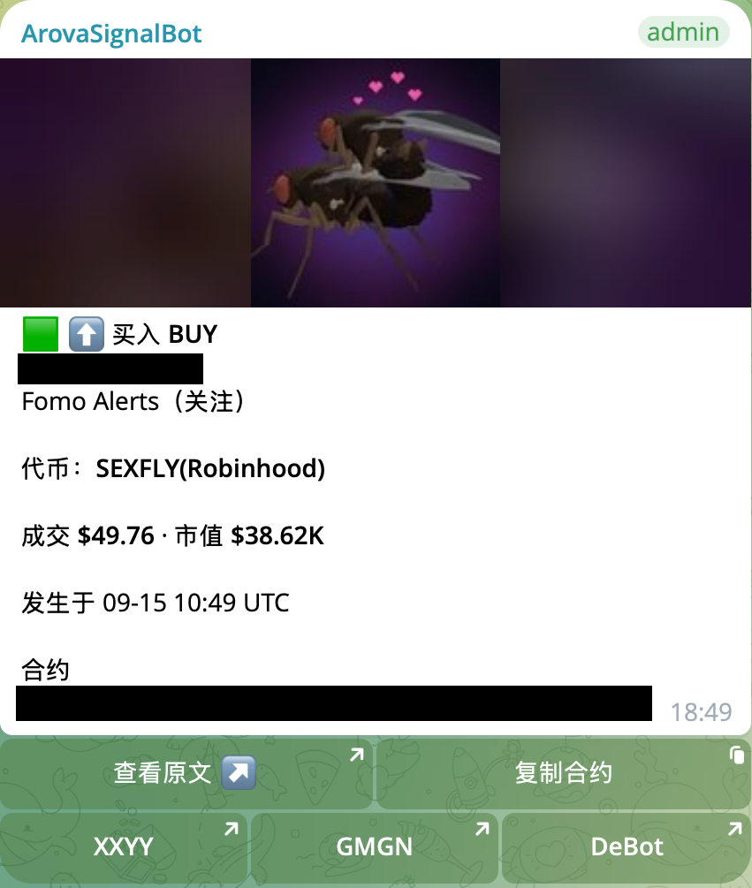

本次图文流程验证了邮箱注册与登录、Fomo/Pump 连接和续期授权保存、Telegram 独立保存与测试，以及 Fomo 实时收件。Pump 实时收件、两平台自然到期后的长期续期未在此次截图流程中验证。

### 截图隐私说明
邮箱、个人昵称、钱包地址、群标识及其他关键数据使用实心遮盖。密码和私钥只在本人设备/指定配置页输入，不拍摄完整内容。平台原文、昵称和自定义备注不自动翻译。
